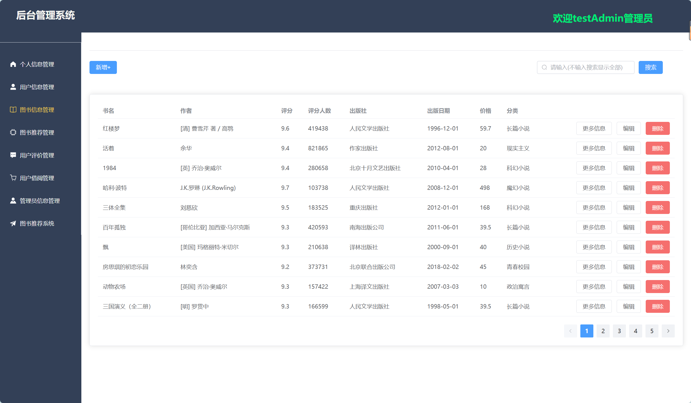
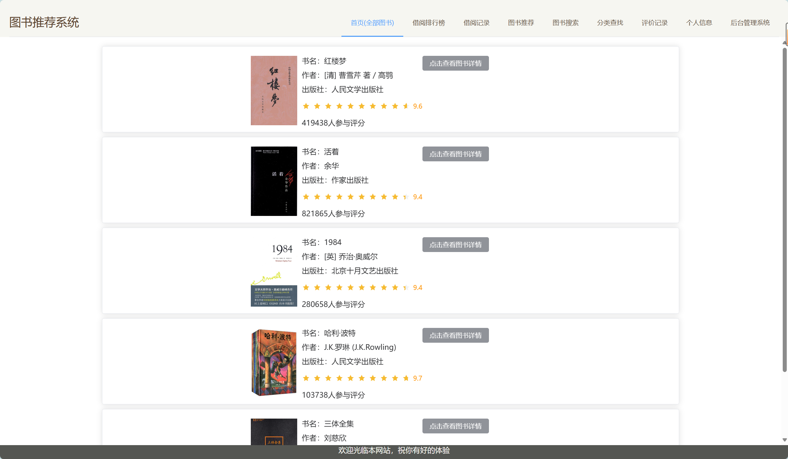

# 关于本系统

## 一、系统简介

本系统为基于协同过滤算法的图书推荐系统，包括前台和后台，前台为图书推荐系统供用户使用，后台为后台管理系统供管理员使用。

## 二、技术介绍

### 1.前端技术

```
HTML,CSS,JavaScript,Vue3，Element Plus,axios,vite等等
```

### 2.后端技术

```
python,Django,DRF
```

### 3.数据库技术

```
MySQL
```

### 4.推荐算法

基于用户的协同过滤算法，Pearson相关系数计算相似度，K-近邻排序，定时任务定时执行。

## 三、下载配置本系统流程

你要有python环境：python版本为3.11.5

你要有Vue3、npm、Vite环境

### 1.将本项目克隆到本地

```
git clone https://github.com/Orekrigo/project.git
```

### 2.将数据库文件导入自己的数据库

可以使用Navicat等工具导入project.sql，也可以使用命令：

```
source project文件路径
```

注意：数据有限，若想增加自行增加

不要忘了将backend/backend/settings.py中的数据库密码等信息改成自己的。

### 3.安装后端所需第三方包

在backend目录下

首先激活虚拟环境：（也可以使用Pycharm软件内部可视化方式）

```
Windows:    .venv\Scripts\activate
Mac:        source .venv\Scripts\activate
```

安装所需要的包：

```
pip install -r requirements.txt
```

### 4.安装前端所需第三方包

在 frontend\front 路径下

```
npm install
```

### 5.启动前端和后端项目

可利用webstorm、pycharm启动。（别忘了启动MySQL）

也可以使用命令行

数据库：

```
net start mysql  //启动
net stop mysql //停止
```

后端：

```
进入虚拟环境：.venv\Scripts\activate
执行：python manage.py runserver
```

前端：

```
 npm run dev   
```

本地浏览器打开网址

图书推荐系统：  http://localhost:5173/#/login

后台管理系统：  http://localhost:5173/#/backLogin

